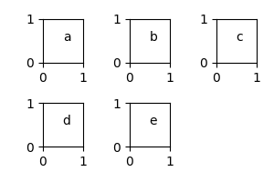
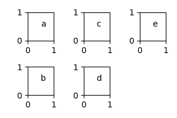

DataPlotGrid
============

``DataPlotGrid`` class is a helper class for creating figures with multiple subplots aligned into a grid.
Its aim is to quickly redistribute multiple plots/values on a 2D grid and automatically calculate their corresponding indexes and grid coordinates.

In the example below, we redistribute 5 integers on a grid with 2 columns.
Note that values can be redistributed horizontally ``transpose=False`` or vertically ``transpose=True``.
If the total number of grid cells exceeds the number of values, one can iterate over empty cells using ``missing=True`` property.

.. code-block::

    >>> from scinumtools import DataPlotGrid
    >>> dpg = DataPlotGrid(list(range(5)), ncols=2)
    >>> list(dpg.items())
    [(0, 0, 0, 0), (1, 0, 1, 1), (2, 1, 0, 2), (3, 1, 1, 3), (4, 2, 0, 4)]
    >>> list(dpg.items(missing=True))
    [(5, 2, 1)]
    >>> list(dpg.items(transpose=True))
    [(0, 0, 0, 0), (1, 1, 0, 1), (2, 2, 0, 2), (3, 0, 1, 3), (4, 1, 1, 4)]
    >>> list(dpg.items(transpose=True, missing=True))
    [(5, 2, 1)]

The above example receives a list of values as an input, however, it is also possible to iterate over a dictionary of key/value pairs.

.. code-block::

    >>> dpg = snt.DataPlotGrid(dict(a=0, b=1, c=2, d=3, e=4), ncols=2)
    >>> list(dpg.items())
    [(0, 0, 0, 'a', 0), (1, 0, 1, 'b', 1), (2, 1, 0, 'c', 2), (3, 1, 1, 'd', 3), (4, 2, 0, 'e', 4)]
    >>> list(dpg.items(missing=True))
    [(5, 2, 1)]
    >>> list(dpg.items(transpose=True))
    [(0, 0, 0, 'a', 0), (1, 1, 0, 'b', 1), (2, 2, 0, 'c', 2), (3, 0, 1, 'd', 3), (4, 1, 1, 'e', 4)]
    >>> list(dpg.items(transpose=True, missing=True))
    [(5, 2, 1)]

Code below is an example how ``DataPlotGrid`` can be used in combination with Python's ``matplotlib`` module.
Note that ``DataPlotGrid`` calculates automatically number of rows/columns and figure size required by the ``plt.subplots()`` method.
Size of individual plot axes can be set by ``axsize`` argument at ``DataPlotGrid`` initialization.

.. code-block:: python

    >>> from scinumtools import DataPlotGrid
    >>> import matplotlib.pyplot as plt
    >>> 
    >>> dpg = DataPlotGrid(['a','b','c','d','e'],ncols=3,axsize=(1,1))
    >>> 
    >>> fig, axes = plt.subplots(dpg.nrows, dpg.ncols, figsize=dpg.figsize, tight_layout=True)
    >>> for i, m, n, v in dpg.items():
    >>>     ax = axes[m,n]
    >>>     ax.text(0.5, 0.5, v)
    >>> for i, m, n in dpg.items(missing=True):
    >>>     ax = axes[m,n]
    >>>     ax.set_axis_off()
    >>> plt.show()

On the corresponding figure, we can see, that number of values is smaller than the number of cells on the grid.
Therefore, we looped over the ``missing`` axes a removed from the figure.

A transposed version of the same example is given below.

.. code-block:: python

    >>> fig, axes = plt.subplots(dpg.nrows, dpg.ncols, figsize=dpg.figsize, tight_layout=True)
    >>> for i, m, n, v in dpg.items(transpose=True):
    >>>     ax = axes[m,n]
    >>>     ax.text(0.5, 0.5, v)
    >>> for i, m, n in dpg.items(transpose=True, missing=True):
    >>>     ax = axes[m,n]
    >>>     ax.set_axis_off()
    >>> plt.show()

