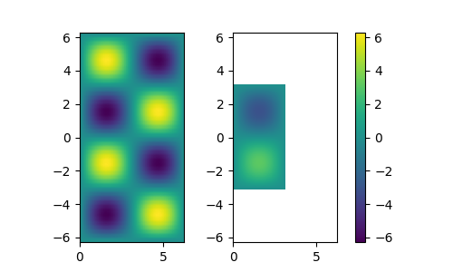

NormalizeData
=============

Numerical data plotted as series of plots and images, often needs to be normalized prior to plotting.
In ``matplotlib`` module, this can be achieved by adding linear and logarithmic norms to images.
The norms require calculations of minimum and maximum values of the plotted data.
Class ``NormalizeData`` offers a quick and concise way to extract these values from each data part and to calculate total normalization constrains for a final figure.

The script below gives an example how to calculate linear and logarithmic norms from a simple list.

.. code-block:: python

    >>> from scinumtools import NormalizeData
    >>> 
    >>> xlen = 10
    >>> ylen = 20
    >>> data = np.linspace(1,xlen*ylen,xlen*ylen).reshape(xlen,ylen) - 10
    >>> 
    >>> with NormalizeData() as n:
    >>>     for row in data:
    >>>         n.append(row)
    >>>     linnorm = n.linnorm()
    >>>     linnorm.vmin, linnorm.vmax
    (-9.0, 190.0)
    >>>     n.lognorm()
    <matplotlib.colors.LogNorm at 0x1275e4410>
    >>>     n.zranges()
    Ranges(minpos=1.0, min=-9.0, max=190.0)
    
Data domains (axis) can also vary from plot to plot.
Extents of x, and y axes are calculated in a following example.

.. code-block:: python

    >>> with NormalizeData(xaxis=True, yaxis=True) as n:
    >>>     for r,row in enumerate(data):
    >>>         xdata = np.linspace(-r,r,xlen)
    >>>         ydata = np.linspace(-r*2,r*2,ylen)
    >>>         n.append(row, xdata, ydata)
    >>>     n.xranges()
    Ranges(minpos=0.11111111111111116, min=-9.0, max=9.0)
    >>>     n.yranges()
    Ranges(minpos=0.10526315789473673, min=-18.0, max=18.0)

In the example below we, calulate norms from two sets of image data and plot them using normalized color in ``matplotlib``.

.. code-block:: python

    >>> from scinumtools import NormalizeData
    >>> import matplotlib.pyplot as plt
    >>> import numpy as np
    >>> 
    >>> with NormalizeData(xaxis='lin', yaxis='lin') as nd:
    >>>     
    >>>     for size in [np.pi*2, np.pi]:
    >>>         xaxis = np.linspace(0,size,50)
    >>>         yaxis = np.linspace(-size,size,50)
    >>>         zdata = size*np.vectorize(lambda x,y: np.sin(x)*np.sin(y))(*np.meshgrid(xaxis,yaxis))
    >>>         nd.append(zdata, xaxis, yaxis)
    >>>     
    >>>     xranges = nd.xranges()
    >>>     yranges = nd.yranges()
    >>>     norm = nd.linnorm()
    >>> 
    >>>     fig, axes = plt.subplots(1,2,figsize=(5,3))
    >>> 
    >>>     for i, (data, extent) in enumerate(nd.items()):
    >>>         ax = axes[i]
    >>>         im = ax.imshow(data, extent=extent, norm=norm)
    >>>         ax.set_xlim(xranges.min, xranges.max)
    >>>         ax.set_ylim(yranges.min, yranges.max)
    >>>     
    >>> fig.colorbar(im, ax=axes.ravel().tolist())
    >>> plt.show()
    
Notice that each plot has diferent x/y axes and different z data value ranges.
``NormalizeData`` class automatically calculates individual data extents, as well as common value ranges of axes and data.
    

