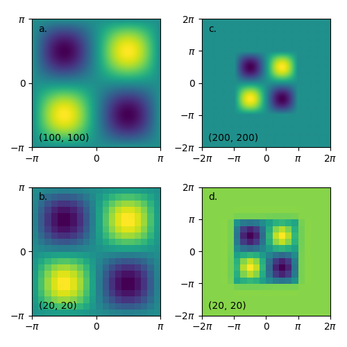

ThumbnailImage
==============

Series of photos, or 2D plots, have often different extents and cannot be plotted with uniform axes on the same figure.
Class ``ThumbnailImage`` helps to address this issue and implements simple image transformations (cropping and resizing) using PIL module.

.. code-block:: python

   >>> from scinumtools import ThumbnailImage
   >>> import matplotlib.pyplot as plt
   >>> import numpy as np
   
   >>> size = np.pi
   >>> size1 = (100, 100)
   >>> xaxis = np.linspace(-size, size, size1[0])
   >>> yaxis = np.linspace(-size, size, size1[1])
   >>> data = size*np.vectorize(lambda x,y: np.sin(x)*np.sin(y))(*np.meshgrid(xaxis,yaxis))
   >>> extent1 = (xaxis.min(), xaxis.max(), yaxis.min(), yaxis.max())
   
   >>> fig, axes = plt.subplots(2,2,figsize=(5,5),tight_layout=True)
   
   >>> ticks1 = [-size,0,size]
   >>> ticks2 = [-size*2,-size,0,size,size*2]
   >>> labels1 = ['$-\pi$','0','$\pi$']
   >>> labels2 = ['$-2\pi$','$-\pi$','0','$\pi$','$2\pi$']
   >>> extent2 = (-size*2, size*2, -size*2, size*2)
   >>> size2 = (20,20)
   >>> plots = [
   >>>   ('a.', 0, 0, ticks1, labels1, ThumbnailImage(data, extent1) ),
   >>>   ('b.', 1, 0, ticks1, labels1, ThumbnailImage(data, extent1).resize(size2) ),
   >>>   ('c.', 0, 1, ticks2, labels2, ThumbnailImage(data, extent1).crop(extent2) ),
   >>>   ('d.', 1, 1, ticks2, labels2, ThumbnailImage(data, extent1).crop(extent2, bgcolor=2).resize(size2) ),
   >>> ]
   >>> for name, m, n, ticks, labels, ti in plots:
   >>>   ax = axes[m,n]
   >>>   ti.draw(ax)
   >>>   ax.text(0.05, 0.9, name, transform=ax.transAxes)
   >>>   ax.text(0.05, 0.05, ti.im.size, transform=ax.transAxes)
   >>>   ax.set_xticks(ticks)
   >>>   ax.set_xticklabels(labels)
   >>>   ax.set_yticks(ticks)
   >>>   ax.set_yticklabels(labels)

In the code example, we create 4 different versions of the same plot:

a) Original function plot
b) Reduced plot resolution from 100x100 to 20x20
c) Added :math:`\pi` padding to the image
d) Combination of b) and c) with specified padding background color

Note that ``crop()`` functions automatically modifies image resolution proportionally to the change of the image extent (compare a. and b. cases).
If an extent is not specified, it is automatically set to ``(0,1,0,1)``.

``ThumbnailImage`` also works with RGB color maps. One just needs to change mode from ``F`` to ``RGB`` and input image data with tuples of RGB/RGBA values instead of scalars. 

Finally, it is also possible to load images from files, modify them and again save them as a new file.
Image files are automatically opened in ``RGB`` mode. 

.. code-block::

   >>> ThumbnailImage('original_image.png').resize(20,30).save('resized_image.png')