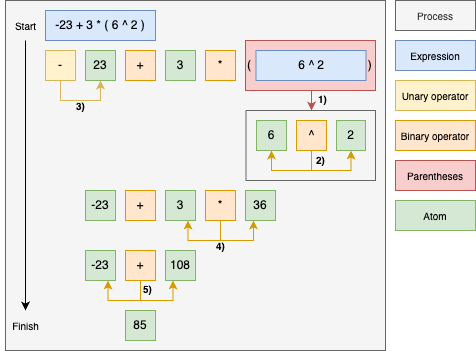

Expression Solver
=================

In this section, we describe basic functionality of the expression solver.
This tool has been implemented as a submodule in order to standardize solving of numerical expression in :ref:`units/index:physical units` and logical/numerical expressions in :ref:`dip/index:dimensional input parameters`. 
For more details and implementation patterns, we refer our reader directly to the source code of the mentioned submodules and corresponding PyTest-s.
Nevertheless, it can be easily modified and used in other projects that require some mathematical expressions.

Expression solver consist of the following classes:

**Solver**

  Main class of the solver.
  
**Expression**

  Expression class handles an expression string that is being parsed into tokens.
  
**Tokens**

  This class contains a list of parsed tokens (atoms and operators).

**Atom**

  Class that specifies how data is parsed from atomic expressions and implements mathematical operations on the data.
 
**Operators**

  Each operator (e.g. addition, multiplication, logarithm....) is implemented as a separate class and performs corresponding operations with tokens.
  
Expression solver comes with a default atom parser that can be used straight out of the box on basic numerical,

.. code-block::

   >>> from scinumtools.solver import *
   >>> with ExpressionSolver(AtomBase) as es:
   ...     es.solve("1 * ((2+3) / +3 - -10 ) + (-23 *++2) + 23**2")
   Atom(494.6666666666667)
   >>> 1 * ((2+3) / +3 - -10 ) + (-23 *++2) + 23**2
   494.6666666666667
   
comparison and logical expressions.

.. code-block::

   >>> import numpy as np
   >>> with ExpressionSolver(AtomBase) as es:
   ...     es.solve("sin(23) < 1 && 3*2 == 6 || !(23 > 43) && cos(0) == 1")
   Atom(True)
   >>> np.sin(23) < 1 and 3*2 == 6 or not (23 > 43) and np.cos(0) == 1
   True

Atoms
^^^^^

Atom parser is a central part of every solver, because it converts atomic expression into specific data type and implements operations with the data. Default atom class implements parsing and operation on float numbers. Functionality of the atom can be easily modified, as shown in the example below.

.. code-block::

    >>> foo = 3
    >>> bar = 4
    >>> class Atom(AtomBase):
    >>>     def __init__(self, value:str):
    >>>         if value=='foo':
    >>>             self.value = foo
    >>>         elif value=='bar':
    >>>             self.value = bar
    >>>         else:
    >>>             self.value = float(value)
    >>> with ExpressionSolver(Atom) as es:
    >>>     es.solve('foo < bar && foo * bar == 12')
    Atom(True)
    >>> foo < bar and foo*bar==12
    True

Operators
^^^^^^^^^

A list of default operations is given in the table below. 

.. csv-table:: List of operators
   :widths: 30 20 30
   :header-rows: 1

   Name,                    Abbreviation,             Operation
   Addition,                add,                      "unary +A and binary A+B"
   Subtraction,             sub,                      "unary -A and binary A-B"
   Multiplication,          mul,                      "A*B"
   Division,                truediv,                  "A/B"
   Parenthesis,             par,                      "\(E\)"
   Exponential function,    "pow, exp, powb",         "A**B, exp(E), powb(E1,E2)"
   Logarithmic functions,   "log, log10, logb",       "log(E), log10(E), logb(E1,E2)"
   Trigonometric functions, "sin, cos, tan",          "sin(E), cos(E), tan(E)"
   Equality,                "eq, ne, lt, gt, le, ge", "A==B, A!=B, A<B, A>B, A<=B, A>=B"
   Logical operators,       "and, or, not",           "A&&B, A||B, !B"
   
Symbols ``A`` and ``B`` used in the table stand for atoms and ``E`` for expressions.

Operators can be easily overloaded or modified to match needs of your project.

.. code-block::

    >>> class CustomOperatorNot(OperatorNot):
    >>>     symbol: str = 'not'
    >>> operators = {'not':CustomOperatorNot}
    >>> with ExpressionSolver(AtomBase, operators) as es:
    >>>     es.solve('not 1')
    False

Operation steps
^^^^^^^^^^^^^^^

It is very important, that operations described above are evaluated in a correct order after each other.
The table below summarizes evaluation steps, from first to last, that are implemented in the code.

.. csv-table:: Operation steps
   :widths: 20 50
   :header-rows: 1
   
   Type,        Operators
   parenthesis, "log, log10, logb, exp, sqrt, powb, sin, cos, tan, par" 
   unary,       "add, sub"
   binary,      pow
   binary,      "mul, truediv"
   binary,      "add, sub"
   binary,      "eq, ne, le, ge, lt, gt"
   unary,       not
   binary,      and
   binary,      or
   
Decomposition of a string expression into tokens and subsequent action of operators on atoms is depicted in the figure below.
First, expressions in parentheses ``1)`` are solved in a sub-process ``2)``.
In the second step, unary operations ``3)`` are evaluated.
After that, binary operations ``4)`` and ``5)`` bring the rest of the expression to the final solution.
Logical and comparison operations are not included in the figure, but if used, they are evaluated in the order from the table discussed earlier.

Order of operations can be used as it is, but it can be also modified.
In the following example, we introduce completely new operators and implement their order into a custom operation step sequence.

.. code-block::

    >>> class OperatorSquare(OperatorBase):   # operate from left side
    >>>     symbol: str = '~'
    >>>     def operate_unary(self, tokens):
    >>>         right = tokens.get_right()
    >>>         tokens.put_left(right*right)
    >>> class OperatorCube(OperatorBase):     # operate from right side
    >>>     symbol: str = '^'
    >>>     def operate_unary(self, tokens):
    >>>         left = tokens.get_left()
    >>>         tokens.put_left(left*left*left)
    >>> operators = {'square':OperatorSquare,'cube':OperatorCube,'add':OperatorAdd}
    >>> steps = [
    >>>     dict(operators=['square','cube'], otype=Otype.UNARY),
    >>>     dict(operators=['add'],           otype=Otype.BINARY),
    >>> ]
    >>> with ExpressionSolver(AtomBase, operators, steps) as es:
    >>>     es.solve('~3 + 2^')
    Atom(17)
    
Sometimes also atom class needs to be modified to achieve a desired solution.

.. code-block::

    >>> class AtomCustom(AtomBase):
    >>>     value: str
    >>>     def __init__(self, value:str):
    >>>         self.value = str(value)
    >>>     def __add__(self, other):
    >>>         return AtomCustom(self.value + other.value)
    >>>     def __gt__(self, other):
    >>>         return AtomCustom(len(self.value) > len(other.value))
    >>> operators = {'add':OperatorAdd,'gt':OperatorGt,'par':OperatorPar}
    >>> steps = [
    >>>     dict(operators=['par'],  otype=Otype.ARGS),
    >>>     dict(operators=['add'],  otype=Otype.BINARY),
    >>>     dict(operators=['gt'],   otype=Otype.BINARY),
    >>> ]
    >>> with ExpressionSolver(AtomCustom, operators, steps) as es:
    >>>     es.solve("(limit + 100 km/s) > (limit + 50000000000 km/s)")
    Atom('False')
